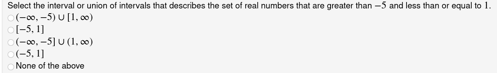
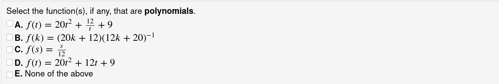
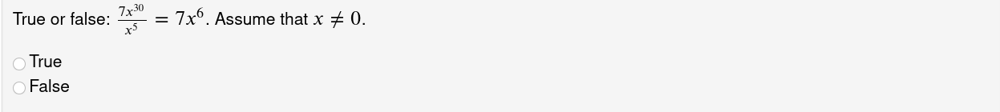
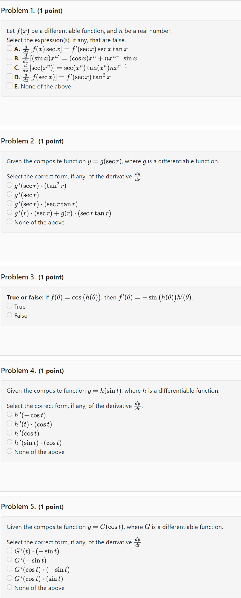

# Diagnostic Quizzes for Calculus

## About the Quizzes

Each Quiz contains five questions that are drawn randomly from a larger grouping set of ten or more questions.
Each question is one of three types: (1) Multiple Choice, (2) Multiple Select, or (3) True or false.

### Examples of the three types of questions

#### Multiple Choice

Exactly one answer is correct. The choice order changes, but “None of the above” is always last.

#### Multiple Select

At least one answer is correct. The choice order changes, but “None of the above” is always last.

#### True or False

### Use Diagnostic Quizzes Out of the Box

Each Quiz contains five questions that are drawn randomly
from a larger grouping set of ten or more questions.
Refer to the [Tables below on Quiz grouping sets](#quiz-grouping-sets-calculus-1).
Each Quiz is a timed quiz to be completed in 15 minutes.

!!! note

    There are many ways randomization occurs in these quizzes, such as: random choice of five questions, random order in which choices appear in the Multiple choice or select types, as well as random changes in numbers, variables, words and phrases, and functions.

### Example

To use _Quiz 16 Chain Rule with Trig_ (Note: the grouping set is topic-diffrules-chain-withtrig)

!!! info

    Unlike a regular WeBWorK homework assignment whose definition depends on two types of files,
    problem (`.pg`) files and set definition (`.def`) files, these quizzes depend on
    _three_ types of files.  The problem files live in the library as usual, but to use these quizzes,
    you will have to import both the quiz set _and_ one or more _grouping sets_ into your WeBWorK course.

1. Import the Quiz and its Grouping Set  
    Hmwk Sets Editor :material-arrow-right: Import tab:
    * Import how many sets? Multiple sets
    * Import from where?  
    calculus-1-diagnostic-quiz/setQuiz_16_Chain_Rule_with_Trig.def  
    calculus-1-diagnostic-quiz/settopic-diffrules-chain-withtrig.def
1. Assign the Quiz and unassign the Grouping Set  
    Hmwk Sets Editor :material-arrow-right: Set List :material-arrow-right: Edit Assigned Users column (click on the ratio, e.g., 1/24 if there are 24 users):
    * Quiz 16 Chain Rule with Trig :material-arrow-right: Assign to students  (e.g., 24/24 for all users)
    * topic-diffrules-chain-withtrig :material-arrow-right: Assign to no one (e.g., 0/24 for no users)
1. Quiz Open and Close Dates   
Hmwk Sets Editor :material-arrow-right: Set List :material-arrow-right: Click on the pencil beside the Quiz, e.g. Quiz 16 Chain Rule with Trig :material-arrow-right: Modify dates:  
    * Opens:
    * Closes:
    * Answers Available:
1. Quiz Default Settings

    | Setting | Default |
    |---|---|
    | Test Time Limit (min; 0=Close Date) | 15 |
    | Cap Test Time at Set Close Date? |  No |
    | Number of Graded Submissions per Test (0=infty) |  0 |
    | Time Interval for New Test Versions (min; 0=infty) |  0 |
    | Number of Tests per Time Interval (0=infty) |  0 |
    | Order Problems Randomly |  No |
    | Number of Problems per Page (0=all) |  0 |
    | Show Scores on Finished Assignments? |  Yes |
    | Show Problems on Finished Tests? |  Yes |

### Use or Modify a Specific Diagnostic Quiz Question

### Example: use a Chain Rule question with trig

All the questions on this topic are in the grouping set called topic-diffrules-chain-withtrig. Either import the grouping set through Hmwk Sets Editor, or view the grouping set definition file through the Library Browser. The Library Browser has the advantage of easily viewing different randomizations of each question.

#### Option 1 - Import the Grouping Set

Hmwk Sets Editor :material-arrow-right: Import tab:  

* Import how many sets? Single set  
* Import from where?  
    calculus-1-diagnostic-quiz/settopic-diffrules-chain-withtrig.def

#### Option 2 - View the Set Definition File

* Library Browser :material-arrow-right: Set Definition Files
* Browse from: Select a Set Definition File  :material-arrow-right:  from the drop-down menu choose  
    calculus-1-diagnostic-quiz/settopic-diffrules-chain-withtrig.def

### Randomization - Be Aware

Before using a specific question, view several versions of it to see how it changes, or view the code itself.
Beyond the randomization of coefficients, words or complete phrases could change, as well as the function that displays. 

!!! caution
    Say you want to assign a Chain Rule question specifically with the arctangent function,
    just be aware that the function displayed could change to the arccosine or the tangent function for some students.

### Report Bugs

If you notice an error or any unexpected behaviour in a question or a quiz,
please report it to:  Michèle Titcombe, Svetla Vassileva, or Malcolm Harper.

## Appendices

### Example: One version of Calculus 1 Quiz 16 Chain Rule with Trig

### Quiz Grouping Sets, Calculus 1

| Number | Title | Grouping Set |
|---|---|---|
| Quiz 1 | Limits Using Graphs | topic-limits-graphs |
| Quiz 2 | One-Sided Limits | topic-limits-onesided |
| Quiz 3 | Properties of Limits | topic-limits-laws-properties |
| Quiz 4 | Infinite Limits and Vertical Asymptotes | topic-limits-infinite-VA |
| Quiz 5 | Continuity and Intermediate Value Theorem | topic-limits-continuity-ivt |
| Quiz 6 | Limits at Infinity and Horizontal Asymptotes | topic-limits-at-infinity-HA |
| Quiz 7 | Limit Definition of the Derivative | topic-derivatives-limit-definition |
| Quiz 8 | Derivative of Natural Exponential Function | topic-diffrules-exp-base-e |
| Quiz 9 | Basic Differentiation Rules | topic-diffrules-basic |
| Quiz 10 | Product and Quotient Rules | topic-diffrules-prodquot-notrig |
| Quiz 11 | Chain Rule | topic-diffrules-chain-notrig |
| Quiz 12 | Implicit Differentiation | topic-implicit-differentiation |
| Quiz 13 | Derivative of Natural Logarithmic Function | topic-diffrules-natural-log |
| Quiz 14 | Trigonometric Differentiation Rules | topic-diffrules-trig |
| Quiz 15 | Product and Quotient Rules with Trig | topic-diffrules-prodquot-withtrig |
| Quiz 16 | Chain Rule with Trig | topic-diffrules-chain-withtrig |
| Quiz 17 | Mixed Differentiation Rules | topic-diffrules-mix |
| Quiz 18 | Inverse Trigonomatric Differentiation Rules | topic-diffrules-inverse-trig |
| Quiz 19 | Derivative of General exponential function | topic-diffrules-exp-base-a |
| Quiz 20 | Derivative of General logarithmic function | topic-diffrules-log-base-a |
| Quiz 21 | Related Rates | topic-related-rates |
| Quiz 22 | Differentials and Linear Approximation | topic-differentials |
| Quiz 23 | Derivatives and Shape of Graph | topic-shape-of-graph |
| Quiz 24 | L'Hopital's Rule | topic-limits-lhopitals-rule |

### Quiz Grouping Sets, Pre-Calculus

| Number | Title | Grouping Set |
|---|---|---|
| Quiz 0 | Math Vocabulary with Theory | theory-math-vocabulary |
| Quiz 1 | Vocabulary | topic-math-vocabulary |
| Quiz 2 | Exponent Laws | topic-exponent-laws |
| Quiz 3 | Factoring | topic-factoring |
| Quiz 4 | Equations | topic-equations |
| Quiz 5 | Intervals | topic-intervals |
| Quiz 6 | Domain | topic-intervals-domain |
| Quiz 7 | Functions | topic-general-functions |
| Quiz 8 | Lines | topic-equations-of-lines |
| Quiz 9 | Curves | topic-basic-curves |
| Quiz 10 | Trigonometry | topic-trigonometry |
| Quiz 11 | Logarithms | topic-logarithms |
| Quiz 12 | Inequalities | topic-inequalities |
| Quiz 13 | Simplifying | topic-simplifying |
| Quiz 14 | Rationalizing | topic-rationalizing |
| Quiz 15 | Logic Symbols | theory-logic-symbols, topic-logic-symbols |
| Mixed Topics 1 |  | from grouping sets 1 - 5 |
| Mixed Topics 2 |  | from grouping sets 6 - 10 |
| Mixed Topics 3 |  | from grouping sets 11 - 15 |
